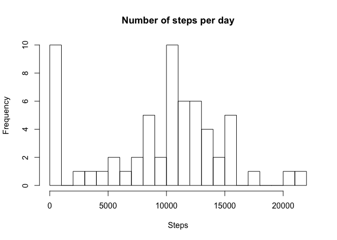
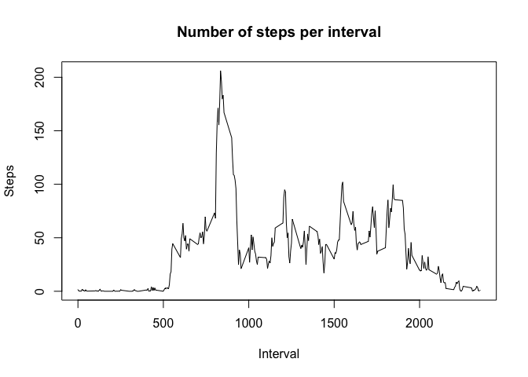
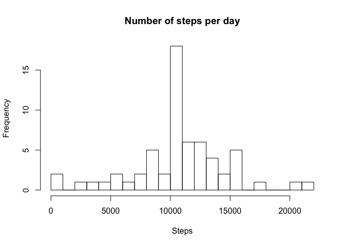
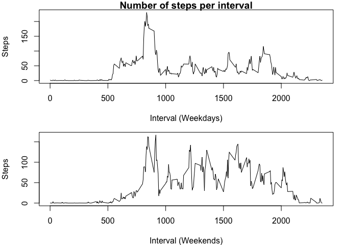

## Loading and preprocessing the data

This simple command is enough to extract the data from the csv file:

```r
activity<-read.csv("activity.csv")
```

## What is mean total number of steps taken per day?

The following code enables us to calculate the number of steps per day:

```r
sum<-with(activity, tapply(as.integer(steps), as.Date(date), sum, na.rm=TRUE))
```

The next line of code enables us to plot the histogram associated to the number of steps per day:

```r
hist(sum, breaks=20, main="Number of steps per day",xlab="Steps")
```

<!-- -->

Finally, the mean and the median are given by the following functions: 

```r
mean(sum)
```

```
## [1] 9354.23
```

```r
median(sum)
```

```
## [1] 10395
```

## What is the average daily activity pattern?

The following code enables us to calculate the average number of steps taken per 5-minute interval:

```r
sum2<-with(activity, tapply(steps, interval, mean, na.rm = TRUE))
```

The next line of code enables us to plot the curve associated to the number of steps per day:

```r
plot(as.integer(names(sum2)), sum2, type="l", xlab="Interval", ylab="Steps", main="Number of steps per interval")
```

<!-- -->

Finally, the maximum value is given by the following line: 

```r
max(sum2)
```

```
## [1] 206.1698
```

It is reached during the following 5-minute interval:

```r
names(which.max(sum2))
```

```
## [1] "835"
```

## Imputing missing values

The following code enables us to calculate and report the number of missing values in the dataset:

```r
number_NA <- sum(is.na(activity))
number_NA
```

```
## [1] 2304
```

The next lines of code enables us to create a new dataset with the missing values of the first filled in with the mean of the corresponding 5-minute interval:

```r
activity2<-activity
for(i in 1:nrow(activity2)){
        if(is.na(activity2[i,1])){
                interv<-activity2$interval[i]
                activity2[i,1]<-sum2[[as.character(interv)]]
        }
}
```

The next line of code enables us to plot the new histogram associated to the number of steps per day:

```r
sum3<-with(activity2, tapply(as.integer(steps), as.Date(date), sum, na.rm=TRUE))
hist(sum3, breaks=20, main="Number of steps per day",xlab="Steps")
```

<!-- -->

Finally, the new mean and median are given by the following functions: 

```r
mean(sum3)
```

```
## [1] 10749.77
```

```r
median(sum3)
```

```
## [1] 10641
```
We can notice the values of mean and median increase slightly when we fill in the database. 

## Are there differences in activity patterns between weekdays and weekends?

The following code enables us to calculate the number of steps per day depending on wheter it is a weekend or a weekday:

```r
nat_date <- as.Date(activity2$date, format = "%Y-%m-%d")
nat_date <- weekdays(nat_date)
for(i in 1:length(nat_date)){
        if(nat_date[i]=="Samedi" || nat_date[i]=="Dimanche"){
                nat_date[i]<- "weekend"
        }
        else{
                nat_date[i]<- "weekday"
        }
}
activity3<-cbind(activity2,nat_date)

sum_weekdays<-with(subset(activity3, nat_date=="weekday"), tapply(steps, interval, mean, na.rm = TRUE))
sum_weekends<-with(subset(activity3, nat_date=="weekend"), tapply(steps, interval, mean, na.rm = TRUE))
```

The next lines of code enable us to plot the curve associated to the number of steps per day depending on wheter it is a weekend or a weekday:

```r
par(mar=c(4,4,1,1))
par(mfrow=c(2,1))
plot(as.integer(names(sum_weekdays)), sum_weekdays, type="l", xlab="Interval (Weekdays)", ylab="Steps", main="Number of steps per interval")
plot(as.integer(names(sum_weekends)), sum_weekends, type="l", xlab="Interval (Weekends)", ylab="Steps")
```

<!-- -->
